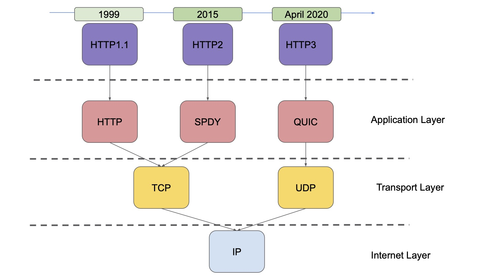
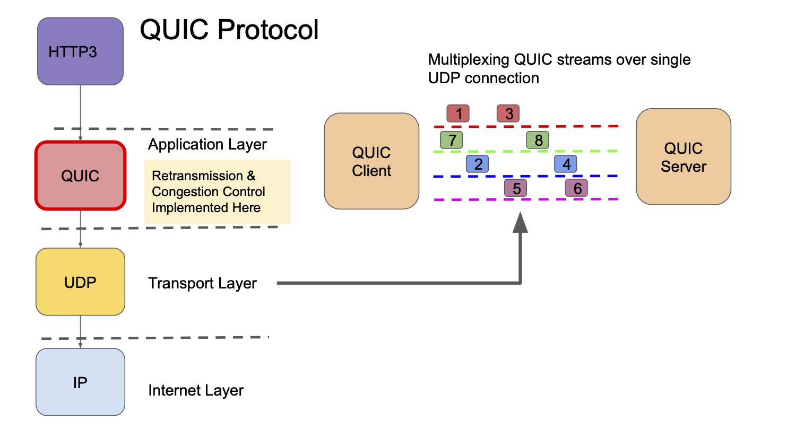
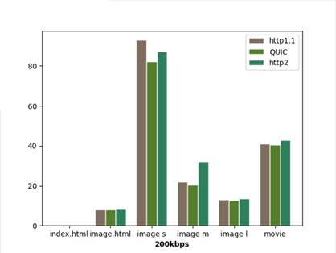
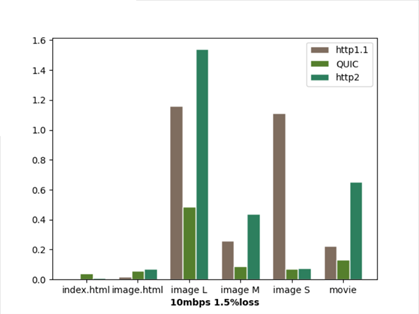

#Reproducing "HTTP over UDP: an Experimental Investigation of QUIC"

**Introducion**   

Across the years, the HTTP protocol has gone through a few iterations, with each new iteration hoping to improve
on the previous one. Both the HTTP protocol and SPDY protocol use TCP in the transport layer to send and receive packets. In 2012, Google introduced the QUIC protocol as an alternative to HTTP and SPDY.   

  
Interestingly, QUIC not only differs from HTTP by using multiplexing to support more packets sending, it differs from SPDY by using the UDP protocol. To overcome UDPs inability to guarantee packet delivery, the QUIC protocol implements retransmission and congestion control on the application layer.   

The goal of our project was to reproduce the research produced in the aforementioned paper while also contributing new data by taking measurements with different parameters while also introducing new implementations to the project methodology.

**Methodology**  
In order to set up the multiple servers that were used in the experimentation, we used AWS instances. This improves on the original paper's implementation where 2 laptops were used across a single network as using AWS instances increases the results relevancy, especially with respect to the cloud computing paradigm.   
We used APACHE to set up HTTP and SPDY servers while using dummy QUIC client and server provided by Google to run our experiments.   
To measure the performance of these protocols across different situation we used *tcconfig* to introduce random losses and bandwidth caps between connections. We used a variety of tools to obtain measurements including *ss*, *time*, *wget* terminal commands.

**Discussion**   

  
   

 

In no loss situations, QUIC shows improvement over both HTTP and SPDY for page load times. Although this is not apparent from the bar graph above (on the left) , we employ a paired-t test to test for statistical significance and in all use cases , we determine that QUIC is in fact able to improve on page load times. This improvement grows in lossy situation (image on the right). We determine that packet retranmission on the application layer is able to cut down time in this case.  In contrast to the original paper, we conduct our experiments with higher and lower bandwidth, higher loss situations and also a more varied set of HTML paper (bigger pictures, plain text and also video files). In general, QUIC has better goodput and consistency.

**Conclusion**  
We observe that QUIC not only outperforms HTTP and SPDY in low bandwidth situations, but especially in lossy situations. Although many servers and websites have yet to adopt QUIC and occasionaly discourage it, we believe that the improvements reproduced in the original paper and the new improvements recorded in our paper serve as proof that QUIC could potentially be adopted in a new iteration of HTTP.